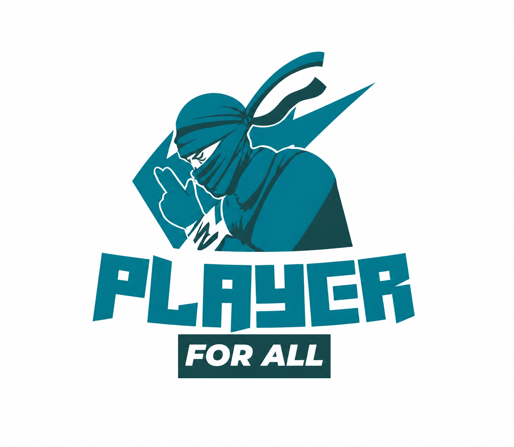

<p align="center">
  
</p>

<h1 align="center">PlayMate</h1>

<p align="center">
  <strong>Find your teammates. Join the game. Dominate the field.</strong>
</p>

<p align="center">
  <a href="#features">Features</a> •
  <a href="#tech-stack">Tech Stack</a> •
  <a href="#getting-started">Getting Started</a> •
  <a href="#project-structure">Project Structure</a> •
  <a href="#screenshots">Screenshots</a> •
  <a href="#contributing">Contributing</a> •
  <a href="#license">License</a>
</p>

<p align="center">
  
  
  
  
  
</p>

---

## 🏟️ About

**PlayMate** is a modern, community-driven web platform that connects sports enthusiasts in their local area. Whether you're looking for a cricket partner, a football team to join, or a volleyball squad for the weekend — PlayMate helps you find players, create game posts, and build your sports community.

Built with a premium, responsive UI featuring glassmorphism, smooth micro-animations, and a dark-mode-ready design system.

---

## ✨ Features

| Feature | Description |
|---|---|
| 🔍 **Smart Search** | Search for players, sports, or locations with a modern, animated search bar |
| 📝 **Create Posts** | Share game details including title, description, sport, location, and images |
| 🏏 **Sports Gallery** | Browse curated sports categories — Cricket, Football, Tennis, Hockey, Basketball, and more |
| 🔐 **Authentication** | Secure sign-in/sign-out powered by NextAuth.js with session management |
| 🌙 **Dark Mode** | Full dark mode support across all components |
| 📱 **Responsive Design** | Mobile-first layout that looks stunning on any device |
| 🔥 **Real-time Data** | Posts stored and fetched from Firebase Firestore in real time |
| 🎨 **Premium UI** | Glassmorphism effects, gradient text, hover animations, and polished micro-interactions |

---

## 🛠️ Tech Stack

| Layer | Technology |
|---|---|
| **Framework** | [Next.js 16](https://nextjs.org/) (Pages Router) |
| **UI Library** | [React 19](https://react.dev/) |
| **Styling** | [Tailwind CSS 4](https://tailwindcss.com/) |
| **Database** | [Firebase Firestore](https://firebase.google.com/docs/firestore) |
| **Authentication** | [NextAuth.js](https://next-auth.js.org/) |
| **Icons** | [React Icons](https://react-icons.github.io/react-icons/) |
| **Fonts** | [Geist](https://vercel.com/font) (via `next/font`) |

---

## 🚀 Getting Started

### Prerequisites

- **Node.js** ≥ 18.x
- **npm** ≥ 9.x
- A [Firebase project](https://console.firebase.google.com/) with Firestore enabled

### 1. Clone the repository

```bash
git clone https://github.com/your-username/playmate.git
cd playmate
```

### 2. Install dependencies

```bash
npm install
```

### 3. Set up environment variables

Create a `.env` file in the root directory with your Firebase and NextAuth credentials:

```env
NEXT_PUBLIC_FIREBASE_API_KEY=your_api_key
NEXT_PUBLIC_FIREBASE_AUTH_DOMAIN=your_auth_domain
NEXT_PUBLIC_FIREBASE_PROJECT_ID=your_project_id
NEXT_PUBLIC_FIREBASE_STORAGE_BUCKET=your_storage_bucket
NEXT_PUBLIC_FIREBASE_MESSAGING_SENDER_ID=your_sender_id
NEXT_PUBLIC_FIREBASE_APP_ID=your_app_id

NEXTAUTH_URL=http://localhost:3000
NEXTAUTH_SECRET=your_nextauth_secret
```

### 4. Run the development server

```bash
npm run dev
```

Open [http://localhost:3000](http://localhost:3000) to see the app.

### 5. Build for production

```bash
npm run build
npm start
```

---

## 📂 Project Structure

```
players/
├── components/          # Reusable UI components
│   ├── Footer.js        # Site-wide footer with brand, links & socials
│   ├── GameImages.js    # Sports category gallery
│   ├── Headrer.js       # Sticky header with auth & navigation
│   ├── Hero.js          # Landing hero section with CTA
│   ├── PostDetails.js   # Individual post card component
│   ├── Posts.js          # Community posts grid layout
│   └── Search.js        # Search bar component
├── config/              # App configuration
│   └── Firebase.js      # Firebase initialization
├── data/                # Static/seed data
├── GamesImagesData/     # Sports image data definitions
├── pages/               # Next.js pages (file-based routing)
│   ├── api/             # API routes (auth, etc.)
│   ├── create-post/     # Post creation page
│   ├── FormPost/        # Form component for creating posts
│   ├── _app.js          # App wrapper with SessionProvider
│   ├── _document.js     # Custom document
│   └── index.js         # Homepage
├── public/              # Static assets (logos, sport images)
├── styles/              # Global CSS
├── utils/               # Utility functions
└── package.json
```

---

## 🎮 Supported Sports

<p align="center">
  🏏 Cricket &nbsp;&nbsp;•&nbsp;&nbsp;
  ⚽ Football &nbsp;&nbsp;•&nbsp;&nbsp;
  🎾 Tennis &nbsp;&nbsp;•&nbsp;&nbsp;
  🏑 Hockey &nbsp;&nbsp;•&nbsp;&nbsp;
  🏐 Volleyball &nbsp;&nbsp;•&nbsp;&nbsp;
  🏀 Basketball &nbsp;&nbsp;•&nbsp;&nbsp;
  ♟️ Chess &nbsp;&nbsp;•&nbsp;&nbsp;
  🏓 Table Tennis
</p>

---

## 📸 Screenshots

> Run the app locally with `npm run dev` and visit `http://localhost:3000` to see the full experience.

**Key Sections:**

- **Hero** — Eye-catching landing section with animated dot grid background and gradient typography
- **Search** — Full-width search bar with pill-style design and gradient CTA button
- **Sports Gallery** — Curated sport category cards with high-quality imagery
- **Community Posts** — Responsive grid of user-generated game posts with hover effects
- **Create Post** — Glassmorphism-styled form with gradient accent and smooth input focus transitions
- **Footer** — Dark-themed footer with brand info, quick links, sports list, and social icons

---

## 🤝 Contributing

Contributions are welcome! Here's how to get started:

1. **Fork** the repository
2. **Create** a feature branch: `git checkout -b feature/amazing-feature`
3. **Commit** your changes: `git commit -m "Add amazing feature"`
4. **Push** to the branch: `git push origin feature/amazing-feature`
5. **Open** a Pull Request

### Guidelines

- Follow the existing code style and component patterns
- Use Tailwind CSS v4 syntax (e.g., `bg-linear-to-r` instead of `bg-gradient-to-r`)
- Ensure responsive design across mobile, tablet, and desktop
- Test dark mode compatibility

---

## 📄 License

This project is open source and available under the [MIT License](LICENSE).

---

<p align="center">
  Built with ❤️ for sports communities worldwide
</p>
